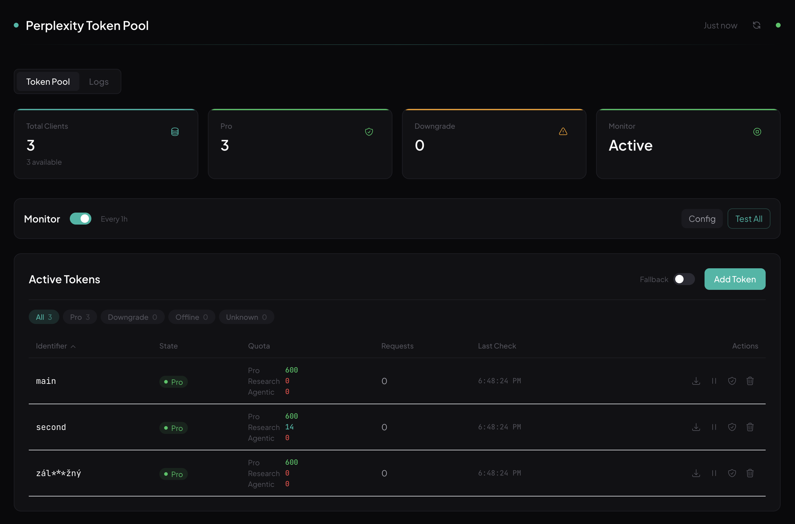
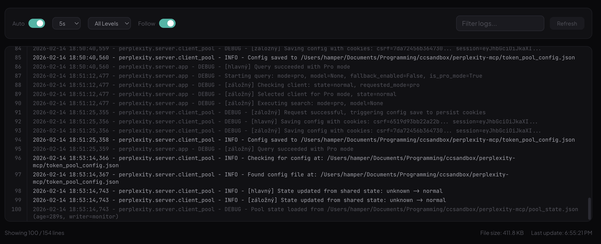

<div align="center">

<!-- Hero -->
<br />


<br />


<br /><br />

**The only Perplexity MCP server with multi-account pooling, an admin dashboard, and zero-cost monitoring.**<br />
**No API keys. No per-query fees. Uses your existing Perplexity Pro session.**

<br />

<a href="https://opensource.org/licenses/MIT"></a>&nbsp;
<a href="https://www.python.org/downloads/"></a>&nbsp;
<a href="https://modelcontextprotocol.io/"></a>&nbsp;
&nbsp;


[Features](#-features) · [Quick Start](#-quick-start) · [Admin Panel](#%EF%B8%8F-admin-panel) · [Configuration](#%EF%B8%8F-configuration) · [Architecture](#%EF%B8%8F-architecture)

<br />

</div>

---

## 🎯 Why This One?

Most Perplexity MCP servers are single-account wrappers around the paid Sonar API. **This one is different:**

- 🆓 **No API costs** — uses session cookies, not the paid API. Same features, zero per-query fees
- 🏊 **Multi-account pool** — round-robin across N accounts with automatic failover
- 📊 **Admin dashboard** — React UI to monitor quotas, manage tokens, tail logs in real-time
- ❤️ **Zero-cost health checks** — monitors all accounts via rate-limit API without consuming queries
- 🛡️ **Downgrade protection** — detects when Perplexity silently returns a regular result instead of deep research
- 📱 **Telegram alerts** — get notified when tokens expire or quota runs out

<a id="-what-this-fork-fixes"></a>
<a id="-benchmark-proper-vs-upstream"></a>

## ✅ What This Fork Fixes & Benchmark

This is a hardened, agent-ready fork of [`teoobarca/perplexity-mcp`](https://github.com/teoobarca/perplexity-mcp). Verified against upstream HEAD `ec19ac9` on `2026-04-19`; feature rows were checked from MCP source/tests, and the security row is from `npm audit` against each frontend lockfile.

<table>
<tr>
<th align="left">Area</th>
<th align="left">Upstream</th>
<th align="left">Proper Perplexity MCP</th>
<th align="left">What changed</th>
</tr>
<tr>
<td><b>Vision uploads</b></td>
<td></td>
<td></td>
<td>Both MCP tools accept <code>attachments</code> from local paths or inline base64/data URLs.</td>
</tr>
<tr>
<td><b>Agent output</b></td>
<td></td>
<td></td>
<td><code>response_format: "json"</code> returns validated <code>structuredContent</code> for automation.</td>
</tr>
<tr>
<td><b>MCP host context</b></td>
<td></td>
<td></td>
<td>Hosts can discover model guidance, attachment rules, defaults, and reusable prompt templates.</td>
</tr>
<tr>
<td><b>Upload safety</b></td>
<td></td>
<td></td>
<td>Attachment count, per-file size, total size, and MIME checks reject bad uploads early.</td>
</tr>
<tr>
<td><b>Transport coverage</b></td>
<td></td>
<td></td>
<td>Integration tests exercise the real MCP stdio transport, not just Python function calls.</td>
</tr>
<tr>
<td><b>Regression suite</b></td>
<td></td>
<td></td>
<td>Coverage now includes attachments, structured output, resources/prompts, and stdio behavior.</td>
</tr>
<tr>
<td><b>Live verification</b></td>
<td></td>
<td></td>
<td>One PowerShell command verifies image upload through the real stdio MCP path.</td>
</tr>
<tr>
<td><b>Codex/Cursor ergonomics</b></td>
<td></td>
<td></td>
<td>Repo guidance teaches agents how to batch research, use visual inputs, and request JSON output.</td>
</tr>
<tr>
<td><b>Frontend dependency audit</b></td>
<td></td>
<td></td>
<td>Frontend toolchain dependencies were upgraded and verified with <code>npm audit</code>.</td>
</tr>
<tr>
<td><b>Public packaging</b></td>
<td></td>
<td></td>
<td>Secrets/runtime artifacts removed; example config, CI, security policy, and contributor docs added.</td>
</tr>
</table>

**Bottom line:** upstream is a useful Perplexity MCP base; this fork is the cleaner agent-ready version with vision uploads, structured outputs, discoverable MCP context, stronger tests, safer packaging, and green CI.

---

## ✨ Features

<table>
<tr>
<td width="50%">

### 🔍 Smart Search
- **Pro Search** — fast, accurate answers with citations
- **Reasoning** — multi-model thinking for complex decisions
- **Deep Research** — comprehensive 10-30+ citation reports
- **Multi-source** — web, scholar, and social

### 🤖 8 Verified Model Choices
- `Sonar` · `GPT-5.4` · `Claude Sonnet 4.6` · `Grok 4.1`
- `GPT-5.4 Thinking` · `Claude Sonnet 4.6 Thinking`
- `Grok 4.1 Reasoning` · `Kimi K2.5 Thinking`

</td>
<td width="50%">

### 🏊 Token Pool Engine
- **Round-robin** rotation across accounts
- **Exponential backoff** on failures (60s → 120s → ... → 1h cap)
- **3-level fallback** — Pro → auto (exhausted) → anonymous
- **Smart quota tracking** — decrements locally, verifies at zero
- **Hot-reload** — add/remove tokens without restart

### 🛡️ Production Hardened
- Silent deep research downgrade detection
- Atomic config saves (no corruption on crash)
- Connection drop handling
- Cross-process state sharing via `pool_state.json`
- 82 tests, including stdio MCP integration coverage

</td>
</tr>
</table>

---

## 🖼️ Screenshots

<div align="center">

### Token Pool Dashboard



<sub>Stats grid, monitor controls, sortable token table with per-account quotas (Pro / Research / Agentic), filter pills, and one-click actions.</sub>

<br /><br />

### Log Viewer



<sub>Live log streaming with auto-refresh, level filtering, search highlighting, follow mode, and line numbers.</sub>

</div>

---

## 🚀 Quick Start

### 1. Clone & Install

```bash
git clone https://github.com/minanagehsalalma/proper-perplexity-mcp.git
cd proper-perplexity-mcp
uv sync
```

### 2. Add to Your AI Tool

<details>
<summary><b>🟣 Claude Code</b></summary>

```bash
claude mcp add perplexity -s user -- uv --directory /path/to/proper-perplexity-mcp run perplexity-mcp
```
</details>

<details>
<summary><b>🟢 Cursor</b></summary>

Go to **Settings → MCP → Add new server** and paste:

```json
{
  "command": "uv",
  "args": ["--directory", "/path/to/proper-perplexity-mcp", "run", "perplexity-mcp"]
}
```
</details>

<details>
<summary><b>🔵 Windsurf / VS Code / Other MCP clients</b></summary>

Add to your MCP config file:

```json
{
  "mcpServers": {
    "perplexity": {
      "command": "uv",
      "args": ["--directory", "/path/to/proper-perplexity-mcp", "run", "perplexity-mcp"]
    }
  }
}
```
</details>

**That's it.** Works immediately with anonymous sessions. Add your tokens for Pro access — see [Authentication](#-authentication).

---

## 🛠️ Tools

Two MCP tools with LLM-optimized descriptions so your AI assistant picks the right one automatically:

### `perplexity_ask`

> AI-powered answer engine for tech questions, documentation lookups, and how-to guides.

| Parameter | Type | Default | Description |
|:----------|:-----|:--------|:------------|
| `query` | string | *required* | Natural language question with context |
| `model` | string | `null` | Model selection (see [models](#-8-verified-model-choices)); leave unset for Best/default |
| `sources` | array | `["web"]` | Sources: `web`, `scholar`, `social` |
| `language` | string | `en-US` | ISO 639 language code |
| `attachments` | array | `null` | Optional image/document uploads. Each item can be a local path string or an object with `path` or `base64_data` |
| `response_format` | string | `markdown` | `markdown` for human-readable output, `json` for structured MCP-friendly output |

**Mode auto-detection:** Models with `thinking` or `reasoning` in the name automatically switch to **Reasoning mode**.

```
"GPT-5.4"                   → Pro Search
"Claude Sonnet 4.6 Thinking" → Reasoning Mode  ← auto-detected
```

### `perplexity_research`

> Deep research agent for comprehensive analysis. Returns extensive reports with 10-30+ citations.

| Parameter | Type | Default | Description |
|:----------|:-----|:--------|:------------|
| `query` | string | *required* | Detailed research question with full context |
| `sources` | array | `["web", "scholar"]` | Sources: `web`, `scholar`, `social` |
| `language` | string | `en-US` | ISO 639 language code |
| `attachments` | array | `null` | Optional image/document uploads. Each item can be a local path string or an object with `path` or `base64_data` |
| `response_format` | string | `markdown` | `markdown` for human-readable output, `json` for structured MCP-friendly output |

> [!TIP]
> Deep research takes 2-5 minutes per query. Provide detailed context and constraints for better results. The server has a 15-minute timeout to accommodate this.

Image uploads can be passed as local files:

```json
{
  "query": "Describe the chart in this screenshot.",
  "attachments": ["C:\\\\Users\\\\you\\\\Pictures\\\\chart.png"]
}
```

Or as inline base64/data URLs:

```json
{
  "query": "What does this image show?",
  "attachments": [
    {
      "base64_data": "data:image/png;base64,iVBORw0KGgoAAAANSUhEUgAA..."
    }
  ]
}
```

When structured downstream consumption matters, set:

```json
{
  "query": "Summarize the uploaded chart.",
  "response_format": "json"
}
```

The MCP tool result still includes display text, and now also returns structured MCP `structuredContent` validated against the tool `outputSchema`.

### Additional MCP Surfaces

Beyond tools, the server now exposes:

- **Resources** — attachment guidance, model catalog, defaults, and a Codex playbook
- **Prompts** — reusable templates for tool selection, batched research, and image-analysis prompt drafting

These help hosts like Codex or Cursor discover best practices without relying only on README text.

### Codex / Cursor Examples

Focused external lookup:

```json
{
  "query": "Compare Next.js App Router auth patterns for JWT refresh rotation in 2026.",
  "sources": ["web"],
  "response_format": "json"
}
```

Visual query with an uploaded screenshot:

```json
{
  "query": "Using only the uploaded screenshot, identify the active tab and the monitor status.",
  "attachments": ["C:\\\\Users\\\\you\\\\Pictures\\\\dashboard.png"]
}
```

### One-Command Smoke Test

Run a live stdio image-upload smoke test with:

```powershell
.\scripts\smoke-image-upload.ps1 -ImagePath .\docs\images\dashboard.png -ShowStructured
```

---

## 🖥️ Admin Panel

A built-in web dashboard for managing your token pool. Start it with:

```bash
perplexity-server
```

Opens automatically at **`http://localhost:8123/admin/`**

| Feature | Description |
|:--------|:------------|
| 📊 **Stats Grid** | Total clients, Online/Exhausted counts, Monitor status |
| 📋 **Token Table** | Sortable columns, filter pills (Online/Exhausted/Offline/Unknown), icon actions |
| 💰 **Quota Column** | Per-token breakdown — Pro remaining, Research quota, Agentic research |
| ❤️ **Health Monitor** | Zero-cost checks via rate-limit API, configurable interval |
| 📱 **Telegram Alerts** | Notifications on token state changes (expired, exhausted, back online) |
| 🔄 **Fallback Toggle** | Enable/disable automatic Pro → free fallback |
| 📥 **Import/Export** | Bulk token management via JSON config files |
| 📝 **Log Viewer** | Live streaming, level filter (Error/Warning/Info/Debug), search, follow mode |
| 🧪 **Test Button** | Run health check on individual tokens or all at once |

---

## 🔐 Authentication

By default, the server uses **anonymous Perplexity sessions** (rate limited). For Pro access, add your session tokens.

### How to Get Tokens

1. Sign in at [perplexity.ai](https://perplexity.ai)
2. Open **DevTools** (F12) → **Application** → **Cookies**
3. Copy these two cookies:
   - `next-auth.csrf-token`
   - `__Secure-next-auth.session-token`

### Single Token

Copy `token_pool_config.example.json` to `token_pool_config.json` in the project root, then fill in your real values:

```json
{
  "tokens": [
    {
      "id": "my-account",
      "csrf_token": "your-csrf-token-here",
      "session_token": "your-session-token-here"
    }
  ]
}
```

### Multi-Token Pool

Add multiple accounts for **round-robin rotation** with automatic failover:

```json
{
  "monitor": {
    "enable": true,
    "interval": 6,
    "tg_bot_token": "optional-telegram-bot-token",
    "tg_chat_id": "optional-chat-id"
  },
  "fallback": {
    "fallback_to_auto": true
  },
  "tokens": [
    { "id": "account-1", "csrf_token": "...", "session_token": "..." },
    { "id": "account-2", "csrf_token": "...", "session_token": "..." },
    { "id": "account-3", "csrf_token": "...", "session_token": "..." }
  ]
}
```

> [!NOTE]
> Session tokens last ~30 days. The monitor detects expired tokens and alerts you via Telegram.

---

## ⚙️ Configuration

### Environment Variables

| Variable | Default | Description |
|:---------|:--------|:------------|
| `PERPLEXITY_TIMEOUT` | `900` | Request timeout in seconds (15 min for deep research) |
| `SOCKS_PROXY` | — | SOCKS5 proxy URL (`socks5://host:port`) |

### Token States

Token state is computed automatically from `session_valid` + `rate_limits` (never set manually):

| State | Meaning | Badge | Behavior |
|:------|:--------|:------|:---------|
| 🟢 `normal` | Session valid, pro quota available | **Online** | Used for all requests |
| 🟡 `exhausted` | Session valid, pro quota = 0 | **Exhausted** | Skipped for Pro, used as auto fallback |
| 🔴 `offline` | Session invalid/expired | **Offline** | Not used for any requests |
| 🔵 `unknown` | Not yet checked | **Unknown** | Used normally (quota assumed available) |

### Fallback Chain

When a Pro request fails, the server tries progressively:

```
1. ✅ Next client with Pro quota (round-robin)
2. ✅ Next client with Pro quota ...
3. 🟡 Any available client (auto mode)
4. 🔵 Anonymous session (auto mode)
5. ❌ Error returned to caller
```

---

## 🏗️ Architecture

```
┌─────────────────────────────────────────────────────────┐
│  Your AI Assistant (Claude Code / Cursor / Windsurf)    │
└──────────────────────┬──────────────────────────────────┘
                       │ MCP (stdio)
                       ▼
┌──────────────────────────────────────────────────────────┐
│  perplexity-mcp                                          │
│  ┌────────────────┐  ┌────────────────────────────────┐  │
│  │  tools.py       │  │  server.py                     │  │
│  │  • ask          │──│  • Pool state sync             │  │
│  │  • research     │  │  • Timeout handling            │  │
│  └────────────────┘  └────────────────────────────────┘  │
└──────────────────────┬───────────────────────────────────┘
                       │
                       ▼
┌──────────────────────────────────────────────────────────┐
│  Backend Engine (perplexity/)                            │
│                                                          │
│  ┌─────────────┐  ┌──────────────┐  ┌────────────────┐  │
│  │  client.py   │  │  client_pool │  │  admin.py      │  │
│  │  • Search    │  │  • Rotation  │  │  • REST API    │  │
│  │  • Upload    │  │  • Backoff   │  │  • Static      │  │
│  │  • Validate  │  │  • Monitor   │  │    files       │  │
│  └──────┬───────┘  │  • Fallback  │  └────────┬───────┘  │
│         │          └──────────────┘           │          │
│         ▼                                     ▼          │
│  ┌─────────────┐                    ┌────────────────┐   │
│  │ Perplexity  │                    │ React Admin UI │   │
│  │ (web API)   │                    │ :8123/admin/   │   │
│  └─────────────┘                    └────────────────┘   │
└──────────────────────────────────────────────────────────┘
```

| Component | File | Role |
|:----------|:-----|:-----|
| **MCP Server** | `src/server.py` | Stdio transport, pool state sync, timeout handling |
| **Tool Definitions** | `src/tools.py` | 2 MCP tools with LLM-optimized descriptions |
| **API Client** | `perplexity/client.py` | Perplexity API via curl_cffi (bypasses Cloudflare) |
| **Client Pool** | `perplexity/server/client_pool.py` | Round-robin, backoff, monitor, state persistence |
| **Query Engine** | `perplexity/server/app.py` | Rotation loop, 3-level fallback, validation |
| **Admin API** | `perplexity/server/admin.py` | REST endpoints + static file serving |
| **Admin UI** | `perplexity/server/web/` | React + Vite + Tailwind dashboard |

---

## 🧪 Development

```bash
# Install in development mode
uv pip install -e ".[dev]" --python .venv/bin/python

# Run unit tests (82 tests)
.venv/bin/python -m pytest tests/ -v

# Frontend development
cd perplexity/server/web
npm install
npm run dev      # Dev server with proxy to :8123
npm run build    # Production build
```

### Project Structure

```
src/                          # MCP stdio server (thin wrapper)
  server.py                   #   Entry point, pool state sync
  tools.py                    #   Tool definitions

perplexity/                   # Backend engine
  client.py                   #   Perplexity API client (curl_cffi)
  config.py                   #   Constants, endpoints, model mappings
  exceptions.py               #   Custom exception hierarchy
  logger.py                   #   Centralized logging
  server/
    app.py                    #   Starlette app, query engine
    client_pool.py            #   ClientPool, rotation, monitor
    admin.py                  #   Admin REST API
    utils.py                  #   Validation helpers
    main.py                   #   HTTP server entry point
    web/                      #   React admin frontend (Vite + Tailwind)

tests/                        # 82 tests, including stdio integration coverage
```

---

## ⚠️ Limitations

- **Unofficial** — uses Perplexity's web interface, may break if they change it
- **Cookie-based auth** — session tokens expire after ~30 days
- **Rate limits** — anonymous sessions have strict query limits
- **Deep research** — takes 2-5 minutes per query (this is normal)

---

## 📄 License

[MIT](LICENSE)
